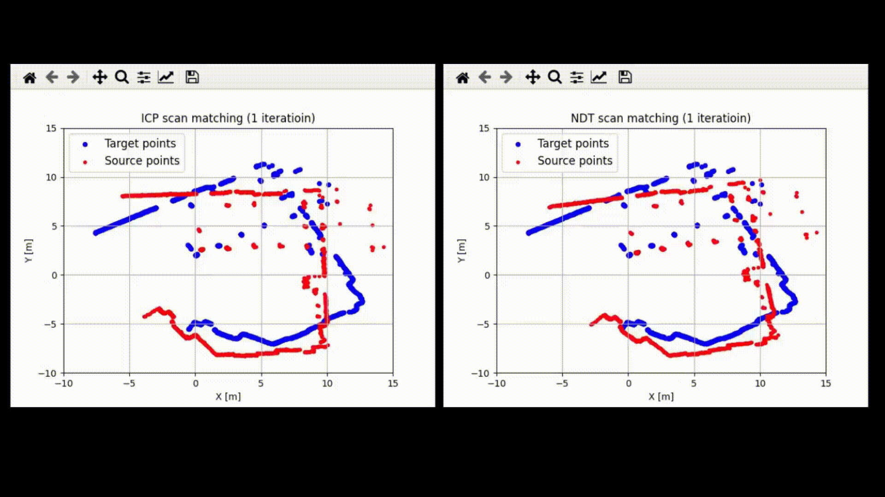

# ICP and NDT with SE(2)

An example python code for Iterative Closest Points (ICP) and Normal Distributions Transform (NDT) scan matching algorithms for 2D point cloud.





ICP

```
# python3 main.py icp
```

NDT

```
# python3 main.py ndt
```


## LICENSE

MIT License
